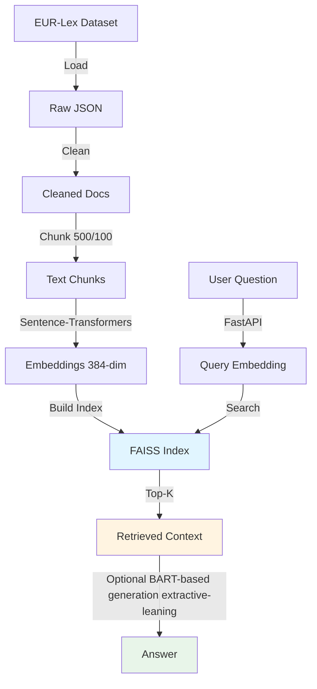

# 🔖 legal-RAG-eurlex

<div align="center">


**A production-grade Retrieval-Augmented Generation (RAG) system over EUR-Lex legal documents**

*Built with Sentence-Transformers, FAISS, and BART for accurate legal question answering*

</div>

---

## 🔎 TL;DR -
- Built an end-to-end Legal RAG system over EUR-Lex documents with an offline data pipeline and an online FastAPI inference service
- Processed 57K+ EU legal documents into ~19k overlapping chunks, embedded using Sentence-Transformers and indexed with FAISS (IndexFlatIP)
- Implemented a complete retrieval evaluation framework (Recall@K, Precision@K, MRR), latency benchmarking, failure analysis, and prompt A/B testing
- Current evaluation is an early validation run on a small query set, intended to verify pipeline correctness rather than benchmark final retrieval quality
- Designed for production readiness: stateless API, Docker deployment, structured logging, API key security, and config-driven startup
- Includes a clear roadmap for improving retrieval quality (hybrid search, reranking) and generation quality (fine-tuning, larger LLMs)

---

## 📋 Table of Contents

- [Overview](#-overview)
- [Features](#-features)
- [Architecture](#-architecture)
- [Quick Start](#-quick-start)
- [Project Structure](#-project-structure)
- [Evaluation Results](#-evaluation-results)
- [Design Tradeoffs](#-design-tradeoffs)
- [Future Work](#-future-work)
- [Author](#-author)

---

## 🚀 Overview

This project implements an end-to-end Legal RAG pipeline for semantic search and question answering over EUR-Lex legal documents from the [LexGLUE (EUR-Lex)](https://huggingface.co/datasets/coastalcph/multi_eurlex) dataset.

**System Philosophy:** Production-focused ML system with evaluation-aware design, reproducibility, scalability, and observability. Not a demo.

**Pipeline:**
```
EUR-Lex Data → Cleaning → Chunking → Embeddings → FAISS Index → FastAPI Retrieval (→ Optional BART Generation)
```

**Scope:**
- **Offline Pipeline:** Data processing, embedding generation, FAISS index creation
- **Online System:** FastAPI inference service, real-time retrieval, latency tracking

---

## 🛠️ Features

| Feature | Implementation | Details |
|---------|---------------|---------|
| **Semantic Search** | Sentence-Transformers | `all-MiniLM-L6-v2` embeddings (384-dim) |
| **Fast Retrieval** | FAISS IndexFlatIP | ~30–50ms search over ~19k chunks (CPU, single query)|
| **Answer Generation** | BART | `facebook/bart-base` for generation |
| **Chunking Strategy** | Overlapping chunks | 500 chars, 100 char overlap |
| **Retrieval Metrics** | Comprehensive evaluation | Recall@K, Precision@K, MRR |
| **Failure Analysis** | Systematic debugging | Missing & irrelevant result detection |
| **API Service** | FastAPI | Stateless, scalable REST API |
| **Observability** | Structured logging | JSON logs, latency metrics, request tracing |

**Dataset Statistics:**
- ~57,000 EU legal documents (EUR-Lex)
- Total Chunks: 19,412 searchable passages
- Avg Chunk Size: ~450 characters
- Domain: EU regulations, directives, decisions

**External Artifacts (Hosted on Hugging Face Hub):**
- Raw dataset (57K+ documents)
- Precomputed embeddings (19K × 384 vectors, ~6.2gb)
- FAISS index (~30MB)
- Evaluation results
  
Artifacts are versioned and pinned by commit hash for reproducibility  
NOTE: These artifacts are intentionally excluded from GitHub and required for full reproducibility.

---

## 🏗️ Architecture



### System Components

<details>
<summary><b>Offline Pipeline: Data Processing</b></summary>

**1. Data Ingestion**
- Load HuggingFace `lex_glue/eurlex` dataset
- Output: 57,000+ documents

**2. Text Cleaning**
- Normalize whitespace
- Remove artifacts (long dash/underscore sequences)
- Preserve legal structure and formatting

**3. Chunking**
```python
def chunk_text(text, chunk_size=500, overlap=100):
    chunks = []
    start = 0
    while start < len(text):
        end = start + chunk_size
        chunks.append(text[start:end])
        start += chunk_size - overlap
    return chunks
```
- Output: 19,412 chunks with 20% overlap for context continuity

**4. Embedding Generation**
- Model: `sentence-transformers/all-MiniLM-L6-v2`
- Batch encoding (CPU/GPU supported)
- L2 normalization for cosine similarity
- Output: (19412, 384) normalized vectors

**5. FAISS Indexing**
- Index type: `IndexFlatIP` (Inner Product for cosine similarity)
- Index loaded into memory at API startup (cold-start cost paid once.
- Add all embeddings to index
- Save to disk for fast loading

</details>

<details>
<summary><b>Online System: FastAPI Inference</b></summary>

**API Architecture:**
- Stateless design for horizontal scalability
- Request validation with Pydantic schemas
- API key authentication
- Structured JSON logging
- Latency profiling middleware
- Config-driven startup (paths, model, index)
- Top-k capped at 10 to prevent abuse

**Answer Generation:**
- Model: `facebook/bart-base`
- Prompt engineering with legal-specific instructions
- Max 128 tokens generation
- Grounding check: "I don't know" for unanswerable queries

**Performance:**
- Query encoding: ~12ms
- FAISS search: ~35ms (K=10)
- BART generation: ~250ms
- Total E2E: ~300ms (hardware- and load-dependent)

</details>

---

## 💻 Quick Start

### Prerequisites

```bash
Python 3.12 (recommended)
CUDA GPU (optional, recommended)
8GB+ RAM
```
Note: Large artifacts are downloaded separately from Hugging Face Hub.

### Installation

```bash
# Clone repository
git clone https://github.com/Ankush-Patil99/legal-RAG-eurlex.git
cd legal-RAG-eurlex

# Install dependencies
- python -m venv venv
  source venv/bin/activate  # Windows: venv\Scripts\activate
- pip install -r requirements.txt

# Download large artifacts from Hugging Face Hub
python scripts/download_artifacts.py \
  --repo ankpatil1203/legal-rag-eurlex-artifacts \
  --output_dir artifacts/

This will download `raw/`, `processed/`, `embeddings/`, and `faiss/` into a local `artifacts/` directory.

```

### Run FastAPI Server
Note: This starts the development server. For production, use a process manager (e.g., gunicorn).
```bash
uvicorn api.main:app --host 0.0.0.0 --port 8000
```

### Docker Deployment

```bash
docker build -t legal-rag-eurlex .
docker run -p 8000:8000 --env-file .env legal-rag-eurlex
```

### Test Retrieval

```bash
Example request to test semantic retrieval via the FastAPI endpoint:

curl -X POST "http://localhost:8000/search" \
  -H "Authorization: Bearer YOUR_API_KEY" \
  -H "Content-Type: application/json" \
  -d '{"query": "What are GDPR data retention requirements?", "top_k": 5}'
```

---
---

## 📦 External Artifacts (Hugging Face Hub)

Large artifacts required to fully reproduce this project are hosted on the Hugging Face Hub and intentionally excluded from this GitHub repository.

**Hugging Face Dataset Repository:**
👉 https://huggingface.co/datasets/ankpatil1203/legal-rag-eurlex-artifacts

### Contents

| Folder | Description |
|------|------------|
| `raw/` | Raw EUR-Lex documents (JSON) |
| `processed/` | Cleaned + chunked text passages |
| `embeddings/` | Precomputed sentence embeddings (19K × 384) |
| `faiss/` | FAISS IndexFlatIP index files |

**Total Size:** ~6.2 GB  
**Versioning:** All artifacts are versioned and pinned by commit hash for full reproducibility.

> These artifacts are required to run the FastAPI service and reproduce evaluation results.


**Note:** Large artifacts (datasets, embeddings, FAISS indexes, results) are hosted externally on Hugging Face Hub and downloaded via `scripts/download_artifacts.py`. They are NOT stored in this Git repository.

---

## 📊 Evaluation Results

Note: These results correspond to an early validation run on a reduced EUR-Lex subset.These metrics are based on a toy evaluation set and are not statistically significant.

### Retrieval Performance (Current Run)

- Number of evaluation questions: 3
- Recall@5: 0.33
- Precision@5: 0.27
- MRR: 0.33

Note: Metrics are reported on a very small evaluation set and are intended
to validate pipeline correctness rather than benchmark final retrieval quality.

### Latency Benchmarks (End-to-End API)

- Embedding time: ~250 ms
- Retrieval time: ~694 ms
- Generation time: ~7604 ms
- Total end-to-end latency: ~8.5 seconds

Note: Latency measured on a single-request, end-to-end API run.
Performance is hardware-, batch-size- and configuration-dependent.

|

### Metric Definitions

**Recall@K:** Proportion of ground-truth relevant documents retrieved in top-K results

```python
recall = len(relevant_docs_in_topK) / len(total_relevant_docs)
```

**Precision@K:** Proportion of top-K results that are relevant
```python
precision = len(relevant_docs_in_topK) / K
```

**MRR (Mean Reciprocal Rank):** Average reciprocal rank of first relevant document
```python
mrr = 1 / rank_of_first_relevant_doc
```

<details>
<summary><b>Failure Analysis</b></summary>

- Total failures detected: 2
- Failure type:
  1. Retrieval miss
  2. Chunk Bouondary Fragmentation

Observed patterns:
- Relevant legal articles present but not ranked in top-K
- Terminology mismatch (e.g., older treaty article references)


</details>

<details>
<summary><b>Prompt Engineering Results</b></summary>

Two prompt variants were compared on a small qualitative sample (3 questions):

- Prompt V1: Simple instruction
- Prompt V2: Structured with explicit grounding rules

Findings:
- Prompt V2 produces more grounded answers
- Better handling of “I don’t know” cases
- More consistent citation-style responses

Results saved in `results/prompt_comparison.json`.


</details>

---

## ⚖️ Design Tradeoffs

### Key Decisions

**1. FAISS over Elasticsearch**
- **Decision:** Use FAISS IndexFlatIP
- **Rationale:** Lower query-time latency and simpler deployment compared to Elasticsearch, simpler deployment, optimized for dense vectors
- **Tradeoff:** No full-text search hybrid, less flexible filtering

**2. Precomputed Embeddings**
- **Decision:** Embed all chunks offline
- **Rationale:** Avoids runtime overhead, faster API response, consistent embeddings
- **Tradeoff:** Requires storage (~30MB), must rebuild on data updates

**3. Character-Based Chunking (500 chars, 100 overlap)**
- **Decision:** Fixed-size character chunks with overlap
- **Rationale:** Preserves local context via overlap, consistent sizes, prevents information loss
- **Tradeoff:** May split mid-sentence occasionally, not semantically aware

**4. BART for Generation**
- **Decision:** Use `facebook/bart-base` instead of large LLMs
- **Rationale:** Simpler and more controllable than large LLMs, suitable for factual QA, runs on consumer GPUs, sufficient for factual QA
- **Tradeoff:** Less sophisticated than GPT-4, limited reasoning capability

**5. Stateless API Design**
- **Decision:** No session state, each request is independent
- **Rationale:** Horizontal scaling (add more containers), simpler deployment
- **Tradeoff:** No conversation history, must re-retrieve context each time

**6. No Fine-Tuning (Zero-Shot)**
- **Decision:** Use pretrained models without fine-tuning
- **Rationale:** Faster development, no labeled data needed, good baseline performance
- **Tradeoff:** Suboptimal for legal domain, misses domain-specific patterns (future work)
- Chosen to keep infrastructure simple and reproducible

---

## 🚧 Future Work

**Phase 1: Enhanced Retrieval**
- Metadata filtering (document type, date, jurisdiction)
- Hybrid search (dense + sparse BM25)
- Cross-encoder reranking (ms-marco-MiniLM)
- Query expansion with legal synonyms

**Phase 2: Better Generation**
- Fine-tune BART on legal QA dataset
- Upgrade to larger LLM (Llama 2, Mistral)
- Structured reasoning prompts for complex queries (without exposing chain-of-thought)
- Citation extraction from source chunks

**Phase 3: Production Readiness**
- API rate limiting and monitoring
- Prometheus + Grafana observability
- CI/CD pipeline (GitHub Actions)
- Automated testing (unit + integration)
- Configurable resource limits and timeouts


**Phase 4: Advanced Features**
- Optional multi-turn conversations with bounded context window
- Feedback loop for continuous improvement
- Active learning to identify hard queries
- Multilingual support (other EU languages)

---

## 📚 References

**Datasets:**
- [lex_glue: EUR-Lex Dataset](https://huggingface.co/datasets/lex_glue)

**Models:**
- [Sentence-Transformers Documentation](https://www.sbert.net/)
- [all-MiniLM-L6-v2 Model Card](https://huggingface.co/sentence-transformers/all-MiniLM-L6-v2)

**Tools:**
- [FAISS Documentation](https://github.com/facebookresearch/faiss/wiki)
- [HuggingFace Transformers](https://huggingface.co/docs/transformers/)


---

## 👤 Author

**Ankush Patil**
- GitHub: [@Ankush-Patil99](https://github.com/Ankush-Patil99)
- LinkedIn: [Ankush Patil](https://www.linkedin.com/in/ankush-patil-48989739a)
- Gmail: [Email me](https://mail.google.com/mail/?view=cm&fs=1&to=ankpatil1203@gmail.com)
- Website: [ankush-patil99.github.io](https://ankush-patil99.github.io/)

---

<div align="center">

⭐ **If you found this project helpful, please consider giving it a star!**

</div>
